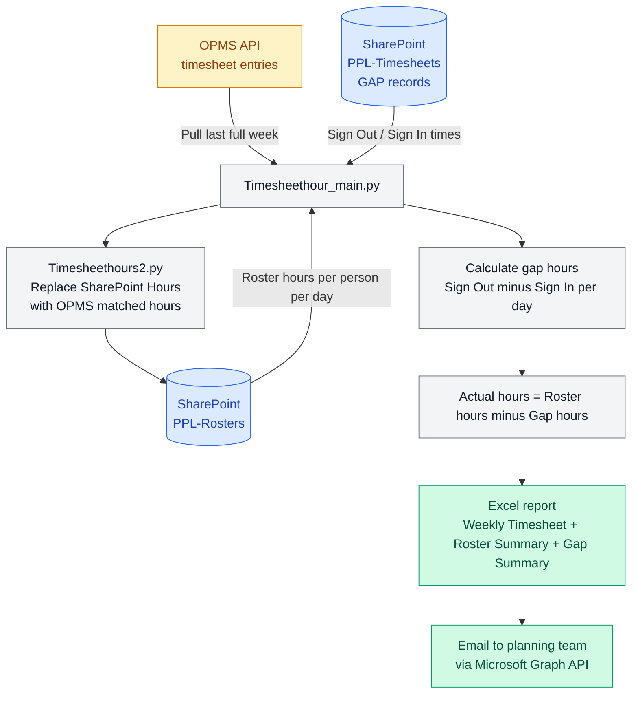

# Marlu Weekly Timesheet Automation

Automated weekly timesheet processing system. Pulls OPMS timesheet data, matches against SharePoint rosters, subtracts gap time (worker exits/returns), generates Excel reports, and emails them automatically.

## How the full system works



## Excel report sheets

| Sheet | Content |
|---|---|
| Weekly Timesheet | Actual worked hours per person per day (roster hours minus gap) |
| Roster Summary | Original roster hours before gap deduction |
| Gap Summary | Gap hours per person per day + unmatched Sign Out records |

## Gap time logic

Gap = time a worker exits and returns to site during their shift.

- Workers submit Sign Out / Sign In via the Gap Time Form (`GapTimeForm/`)
- Sign Out → Sign In pairs are matched chronologically per OPMS ID
- Cross-day gaps over 6 hours are ignored to prevent bad data
- Unmatched Sign Outs (no return recorded) are flagged in the Gap Summary sheet

## Data matching rules

| Field | Source |
|---|---|
| OPMS ID | Matched between OPMS timesheet entries and SharePoint roster |
| Date | Perth timezone — SharePoint UTC dates converted to `Australia/Perth` |
| Hours | OPMS daily hours summed per person per date, written back to SharePoint |
| Vehicles excluded | Roster positions starting with `Z.` at site `Transport & Hire` excluded |

## Technologies

- Python 3.11
- Azure Functions (timer trigger — runs weekly)
- Microsoft Graph API (SharePoint read/write + email)
- OPMS API (timesheet data with cursor pagination + retry)
- openpyxl (Excel generation + formatting)
- GitHub Actions (CI/CD)

## Project Structure

```
Timesheethour_main.py       Main pipeline — orchestrates all steps
Timesheethours1.py          Gap calculation + daily results + Excel export
Timesheethours2.py          OPMS fetch + SharePoint Hours write-back
TimesheethourFormat.py      Excel styling and formatting
TimesheethourEmail.py       Send Excel report via Microsoft Graph API
ExtraUpdateSupplier.py      Supplier data update helpers
function_app.py             Azure Function timer trigger entry point
GapTimeForm/                Gap time Sign Out/Sign In web form (separate app)
ArchivedPYfile/             Old versions
host.json
requirements.txt
```

## Weekly run sequence

1. Calculate last full week range (Monday to Sunday)
2. Pull OPMS timesheet entries for the week
3. Pull SharePoint `PPL-Rosters` for the week
4. Pull SharePoint `PPL-Timesheets` gap records for the week
5. Match OPMS hours to roster rows by OPMS ID + date → write back to SharePoint
6. Calculate gap hours per person per day
7. Subtract gap from roster hours → actual worked hours
8. Generate Excel with three sheets
9. Email Excel to planning team

## Environment Variables

| Variable | Description |
|---|---|
| `OPMS_CLIENT_ID` | OPMS API client ID |
| `OPMS_CLIENT_SECRET` | OPMS API client secret |
| `SHAREPOINT_TENANT_ID` | Azure AD tenant ID |
| `SHAREPOINT_CLIENT_ID` | Azure AD app client ID |
| `SHAREPOINT_CLIENT_SECRET` | Azure AD app client secret |
| `SHAREPOINT_HOST` | SharePoint host |
| `SITE_NAME` | SharePoint site name |
| `LIST_NAME` | Roster list name (default: PPL-Rosters) |
| `GAP_LIST_NAME` | Gap timesheet list name (default: PPL-Timesheets) |
| `SUPPLIER_LIST_NAME` | Supplier lookup list |
| `SITE_LOOKUP_LIST_NAME` | Site lookup list |
| `GRAPH_SENDER` | Email sender address |
| `GRAPH_TO` | Email recipient address |

## Related

- Gap Time Form — `GapTimeForm/` — Flask web app where workers submit Sign Out / Sign In records during their shift
